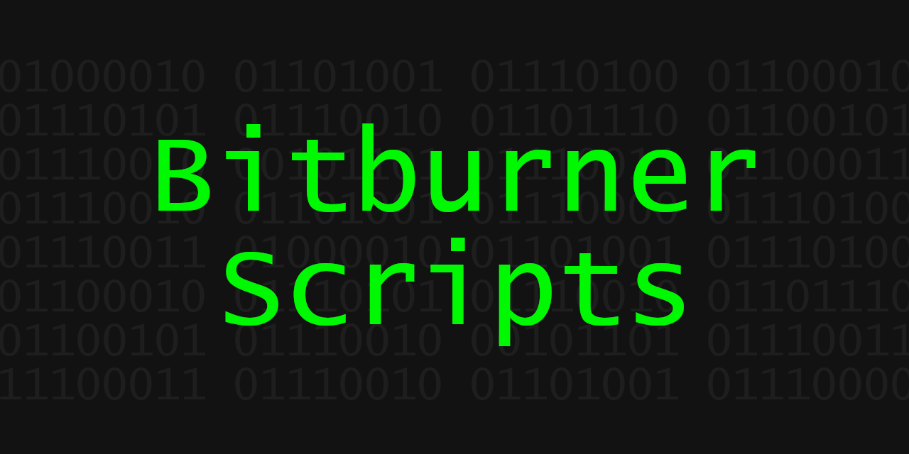

# BitBurner Scripts



A collection of useful scripts for the game [Bitburner](https://store.steampowered.com/app/1812820/Bitburner/).

## buyServers

Purchases the number of requested servers, optionally deleting existing servers in order to make space. Always attempts to purchase the highest amount of RAM for the requested server pool that can currently be afforded.

```bash
# Buy 4 servers
run buyServers.js 4
```

## spider

Crawl all the servers that are reachable from a given target. Defaults to `home`.

```
# All reachable servers from home
run spider.js
# All reachable servers from n00dles
run spider.js n00dles
```

## hackController

Determines the server with the most money, and then sets up a continuous loop of `hack`, `grow` and `weaken` against that target.

Attempts to synchronize the cycles according to the length of time it takes to execute a `hack` so as to not throw off the calculations.

```bash
run hackController.js
```

## hackTarget

`hack` a specific target.

```bash
# Hack n00dles using 2 threads, after an initial wait of 4
run hackTarget.js 2 4 n00dles
```

## growTarget

`grow` a specific target.

```bash
# Grow n00dles using 2 threads, after an initial wait of 4
run growTarget.js 2 4 n00dles
```

## weakenTarget

`weaken` a specific target.

```bash
# Weaken n00dles using 2 threads, after an initial wait of 4
run weakenTarget.js 2 4 n00dles
```

## gainRoot

Open up as many ports as possible, then attempt to gain root on the target server.

```bash
run gainRoot.js n00dles
```